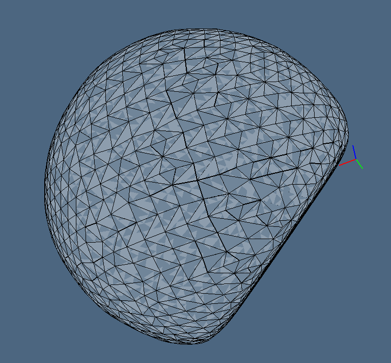
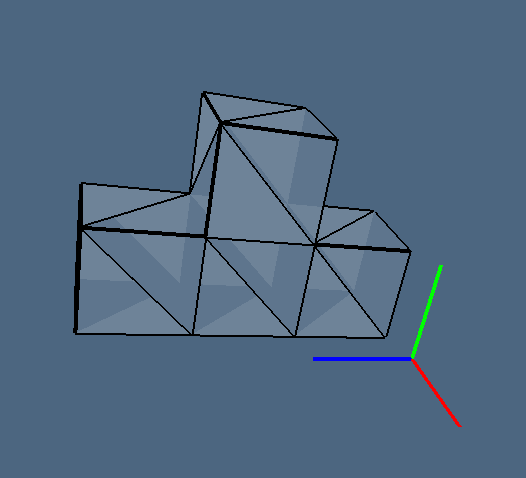
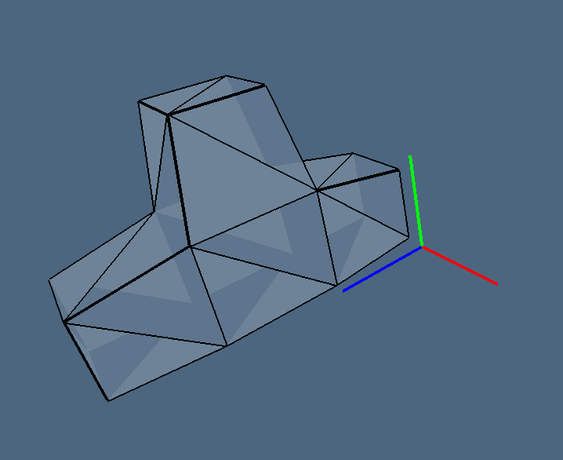
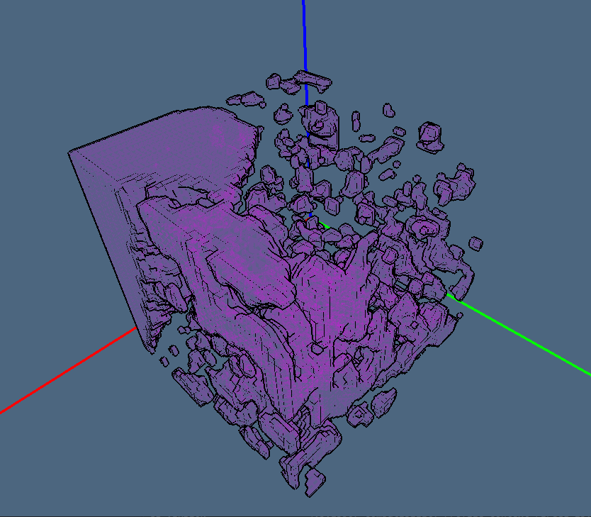
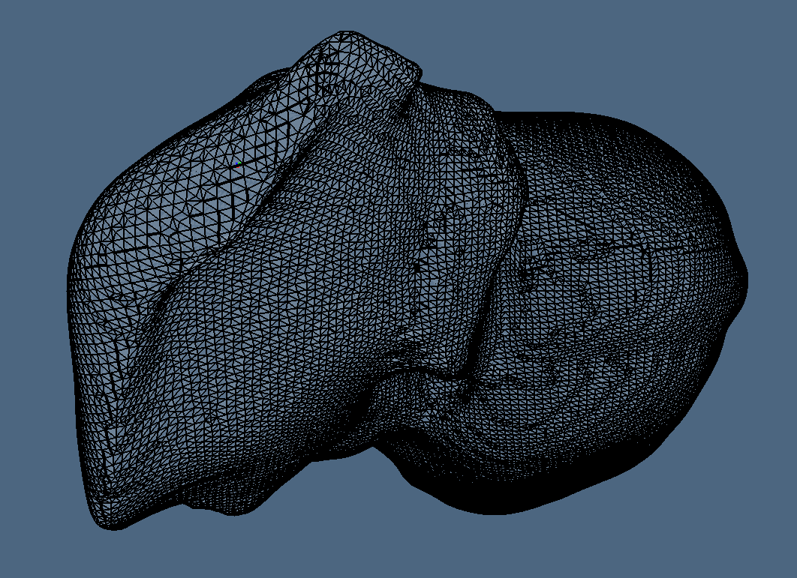

# LarSurf.jl

[](https://travis-ci.org/mjirik/LarSurf.jl)
[](https://coveralls.io/github/mjirik/LarSurf.jl?branch=master)


Package for surface extraction using Linear Algebraic Representation theory by
Alberto Paoluzzi. See
[original Julia repository](https://github.com/cvdlab/LinearAlgebraicRepresentation.jl)
for more details.


# Install


```julia
] add https://github.com/mjirik/ExSup.jl
] add https://github.com/mjirik/LarSurf.jl
```


## Install extra

The package is prepared for pure Julia however for reading various file formats and
the visualization we use additional packages.


### Read 3D data support

To read the
Computed Tomography
data in `DICOM` and other formats we use Io3d.jl package. This package is wrapper for python `io3d`.

Import 3D structures to LARLIB

    conda install -c simpleitk -c mjirik -c conda-forge io3d simpleitk pandas


Install wrappers for python packages to do

```julia
ENV["PYTHON"] = strip(split(read(`$((Sys.iswindows() ? "where" : "which")) python`, String), "\n")[1])
using Pkg; Pkg.add("PyCall") ; Pkg.build("PyCall")
] add Pandas
] add https://github.com/mjirik/Io3d.jl

using Pandas, Io3d

```

### Visualization tools

`ViewerGL` can be used to perform the visualization.

```julia
] add http://github.com/cvdlab/LinearAlgebraicRepresentation.jl#julia-1.0
] add http://github.com/cvdlab/ViewerGL.jl
```


There might be some problems with [DataStructures package version](#datastructures-version-problem)
or with the [Triangle build](#missing-nmake).


## For developers

```
] develop https://github.com/mjirik/LarSurf.jl
```


# Examples

## Truncated sphere example

Do the surface extraction on simple shape. [Source code](examples/show_surface_parallel_truncated_sphere.jl)

```julia
using ViewerGL
using Distributed
addprocs(3)
using Logging
using SparseArrays
@everywhere using LarSurf

block_size = [20, 20, 20]
LarSurf.lsp_setup(block_size)

segmentation = LarSurf.generate_truncated_sphere(10)
V, FV = LarSurf.lsp_get_surface(segmentation)
FVtri = LarSurf.triangulate_quads(FV)

Vs = LarSurf.Smoothing.smoothing_FV_taubin(V, FV, 0.4, -0.3, 50)

ViewerGL.VIEW([
  ViewerGL.GLGrid(Vs,FVtri,ViewerGL.Point4d(1,1,1,0.1))
  ViewerGL.GLAxis(ViewerGL.Point3d(-1,-1,-1),ViewerGL.Point3d(1,1,1))
])

objlines = LarSurf.Lar.lar2obj(Vs, FVtri, "tetris_tri_taubin.obj")
```




## Tetris example

Do the surface extraction on simple shape. [Source code](examples/show_surface_parallel_tetris.jl)

```julia

using ViewerGL
using Distributed
if nprocs() == 1
    addprocs(3)
	@info "adding 3 more CPUs"
end
using Logging
using SparseArrays
@everywhere using LarSurf

block_size = [2, 2, 2]
segmentation = LarSurf.tetris_brick()
LarSurf.lsp_setup(block_size)
larmodel = LarSurf.lsp_get_surface(segmentation)
V, FV = larmodel
FVtri = LarSurf.triangulate_quads(FV)
objlines = LarSurf.Lar.lar2obj(V, FVtri, "tetris_tri.obj")

ViewerGL.VIEW([
  ViewerGL.GLGrid(V,FVtri,ViewerGL.Point4d(1,1,1,0.1))
  ViewerGL.GLAxis(ViewerGL.Point3d(-1,-1,-1),ViewerGL.Point3d(1,1,1))
])
```



```Julia

Vs = LarSurf.Smoothing.smoothing_FV_taubin(V, FV, 0.4, -0.2, 2)

ViewerGL.VIEW([
    ViewerGL.GLGrid(Vs,FVtri,ViewerGL.Point4d(1,1,1,0.1))
	ViewerGL.GLAxis(ViewerGL.Point3d(-1,-1,-1),ViewerGL.Point3d(1,1,1))
])

objlines = LarSurf.Lar.lar2obj(V, FVtri, "tetris_tri_taubin.obj")
```



## Corrosion cast experiment in pure Julia

Run experiment with corrosion cast data. Measure all statistics.

Data can be downloaded [here](http://home.zcu.cz/~mjirik/lisa/sample_data/nrn10.jld2)

```commandline
julia experiments\surface_extraction_parallel.jl --crop 50 -i nrn10.jld2 --show
```



To have more information about options use
```commandline
julia experiments\surface_extraction_parallel.jl --help
```


## Corrosion cast example with PyCall


Data can be downloaded [here](http://home.zcu.cz/~mjirik/lisa/sample_data/nrn10.pklz)

```commandline
julia experiments\surface_extraction_parallel.jl --crop 100 -i nrn10.pklz --show
```


## Liver extraction experiment

Run experiment with extraction of CT data. Measure all statistics.

### Get data

We are using dataset 3D-IRCADb 01 | IRCAD France.

```julia
using Io3d
Io3d.datasets_download("3Dircadb1.1")
datap = Io3d.read3d(Io3d.datasets_join_path("medical/orig/sample-data/nrn4.pklz"))

```
Data can be also manually downloaded from [dataset website](https://www.ircad.fr/research/3d-ircadb-01/)

### Run experiment

Due to long run time the experiment is divided into smaller parts.
The extracted data are stored into `.jld2` files.

* [Surface extraction](experiments/surface_extraction_parallel_ircad01.jl)
	The `stepxy` and `stepz` allow to drop some data for faster debug.
	The `blocks_size` parameter control the size of parallel blocks.
* [Smoothing](experiments/surface_extraction_parallel_ircad01_smoothing.jl)
* [Show extraction](experiments/surface_extraction_parallel_ircad01_show.jl)
* [Create `.obj` file](experiments/surface_extraction_parallel_ircad01_obj.jl)

All measured times are recorded into `.csv` file
(`exp_surface_extraction_ircad_times.csv`)




# Convert volumetric data to jld2 data

```commandline
# julia experiments\to_jld2.jl -i "..\..\..\lisa_data\nrn10.pklz"
```


# Troubleshooting

## PyCall
Problems with install are often caused by PyCall package
	Check the python path

	```commandline
	which python
	```

## DataStructures version problem

There can be some problem with `DataStructures` package version. It is
caused by `ViewerGl`. It require `DataStructures` with version `0.15.0` only.
You will probably need to remove `JLD2` package and then install `DataStructures`
again.

```julia
] remove ExSup
] remove JLD2
] remove DataStructures
] add DataStructures@0.15.0
] add ExSup


```

## Missing nmake

On windows you will need
[Windows SDK](https://developer.microsoft.com/cs-cz/windows/downloads/windows-10-sdk).
Then you need to start julia in `x64 Native Tools Command Prompt for VS 2017` and
build the package.

```julia
] add Triangle
] build Triangle
```

Then you can start julia from `cmd`.
